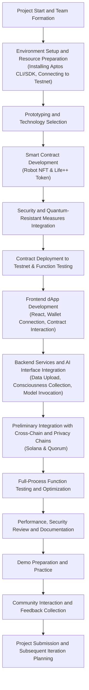
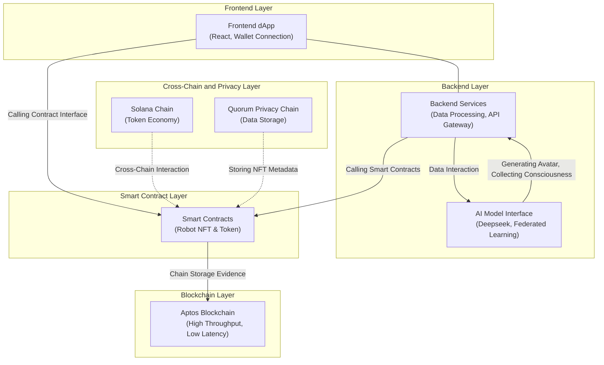

20250409 0G DA Cross-Chain Bridge

## Deck
[Click here](https://docs.google.com/presentation/d/1cqDu_Fmpbm2vfUmYSPaGNnQYscSUpowmCnN9ZYuGg1s/edit?usp=sharing)

---

### Technical Documentation: 0G DA Layer and Cross-Chain NFT Implementation

#### Project Overview

This project leverages 0G's Data Availability (DA) layer to build a cross-chain NFT trading system, ensuring efficient, secure, and cost-effective NFT transfers across multiple chains. Through cross-chain bridging and 0G's DA layer, we solve data storage, validation, and transmission efficiency issues, thereby enhancing NFT interoperability across different chains.

#### 1. **0G DA Layer Introduction**

0G's DA layer is a scalable, efficient data availability solution that supports large-scale decentralized data storage and rapid validation. It enables cross-chain applications and smart contracts to quickly query, validate, and access data through an efficient, distributed storage system.

- **Infinite Scalability**: 0G DA layer scales horizontally through its consensus network, enabling the system to handle more transactions and data, improving network throughput.
- **Modular Architecture**: 0G separates storage, data availability, and consensus, allowing each module to be optimized as needed, enhancing data processing efficiency.
- **Decentralized AI Operating System**: 0G supports decentralized AI applications, providing high-throughput infrastructure to meet large data processing needs, especially for AI workloads.

#### 2. **0G DA and Cross-Chain NFT Transaction Flow**

##### 2.1 **NFT Locking and Signature Generation**
1. **User Operation**: Users select their NFT on the EVM chain (e.g., Ethereum) for locking. The frontend submits NFT ID, user address, and other information to the backend.
2. **Backend Signature Generation**: The backend system generates signature strings using user addresses and NFT-related information, ensuring the legitimacy and immutability of the locking operation. Signatures are stored in the backend's centralized database.
3. **Signature Return**: The generated signature string is returned to the frontend via API.

##### 2.2 **NFT Data Transfer and Validation**
1. **Frontend Request Submission**: After user confirmation, the frontend submits the locked NFT ID, user address, and signature information to the BNB chain contract.
2. **Contract Signature Verification**: The BNB chain contract verifies the submitted signature's validity, and upon validation, begins NFT reminting.
3. **Contract NFT Reminting**: The contract remints the NFT based on signature information and sends it to the target user address.

##### 2.3 **0G DA Layer's Role**
- **Data Storage**: NFT transaction records, signatures, and lock status are stored in 0G's distributed storage system, ensuring data availability and validation.
- **Data Availability Validation**: During cross-chain operations, the 0G DA layer ensures data availability across different chains. Through its unique consensus mechanism and high-throughput design, it can validate cross-chain operation data in real-time.

#### 3. **Technical Architecture**

##### 3.1 **Frontend**
- **Functions**: Users select NFTs for locking, obtain signatures, and submit signature verification requests through the frontend interface.
- **Tech Stack**: Next.js, Vue.js, Web3.js, Ethers.js for blockchain interaction.

##### 3.2 **Backend**
- **Functions**: Generate signatures, record data, verify signatures, and interact with 0G DA layer.
- **Tech Stack**: Node.js (Express/Koa), Web3.js, Ethers.js, MySQL/PostgreSQL.

##### 3.3 **0G DA Layer**
- **Data Storage**: 0G's modular storage system distributes NFT lock information and signatures across multiple storage nodes.
- **Consensus Mechanism**: 0G ensures data validity through validation of randomly selected data availability nodes (DA nodes), preventing data loss or tampering.

##### 3.4 **Cross-Chain Bridge**
- **EVM Chain and BNB Chain Interoperability**: Utilize 0G DA layer for storing and validating NFT data, transferring NFTs from EVM chain to BNB chain through cross-chain bridges. Ensure NFT integrity and consistency across chains.

#### 4. **Core Technology Implementation**

##### 4.1 **Signature Generation and Verification**
Signatures are used to ensure the authenticity and immutability of the NFT locking operation. Below is an example code for signature generation and verification:

- **Signature Generation** (Node.js + Ethers.js):

```javascript
const { ethers } = require('ethers');

// Generate signature
async function generateSignature(nftId, userAddress) {
    const privateKey = 'YOUR_PRIVATE_KEY';
    const wallet = new ethers.Wallet(privateKey);
    const message = ethers.utils.solidityKeccak256(
        ['string', 'address'],
        [nftId, userAddress]
    );
    const signature = await wallet.signMessage(ethers.utils.arrayify(message));
    return signature;
}
```

- **Signature Verification** (Solidity contract):

```solidity
function verifySignature(bytes32 dataHash, bytes memory signature, address expectedSigner) public pure returns (bool) {
    address recovered = recoverSigner(dataHash, signature);
    return recovered == expectedSigner;
}

function recoverSigner(bytes32 dataHash, bytes memory signature) public pure returns (address) {
    return dataHash.recover(signature);
}
```

##### 4.2 **0G DA Layer Data Validation**
0G's DA layer ensures data integrity across cross-chain NFT transactions by verifying data availability:

```solidity
// 0G DA layer data availability verification
function verifyDataAvailability(bytes32 dataHash) public view returns (bool) {
    // Use VRF to get data availability proof from DA nodes
    bytes32 proof = getProofFromDA(dataHash);
    return validateProof(proof, dataHash);
}
```

#### 5. **Deployment and Integration**

##### 5.1 **Deploy 0G DA Layer**
- **Node Deployment**: Deploy 0G DA layer storage nodes to ensure redundant storage and fast access.
- **Cross-Chain Integration**: Integrate NFT interoperability between EVM chain and BNB chain through contracts and APIs.

##### 5.2 **Data Synchronization and Validation**
- 0G DA layer provides cross-chain data synchronization mechanism to ensure data integrity and consistency during NFT transfer from EVM chain to BNB chain.
- Use 0G's consensus mechanism and decentralized verification system to ensure seamless operations across different blockchain networks.

#### 6. **Application Scenarios**

- **Cross-Chain NFT Trading**: Through 0G DA layer, NFTs can be seamlessly transferred across multiple blockchain networks, providing secure, efficient, and cost-effective cross-chain trading solutions.
- **Decentralized Data Market**: 0G DA layer's high-efficiency data storage and validation capabilities make it an ideal choice for decentralized data marketplaces, supporting fast querying and real-time data updates.
- **Decentralized AI Applications**: Utilize 0G DA layer's scalability and high throughput to provide decentralized storage and data validation services for AI models.

#### 7. **Summary**
This project implements cross-chain NFT trading through 0G DA layer, providing an efficient, secure, and cost-effective data availability solution. 0G's distributed storage and verification mechanism, decentralized consensus mechanism, and high-throughput design enable NFT cross-chain transfers, enhancing user experience, and providing strong infrastructure support for decentralized AI and Web3 applications.


### Contract Technology Framework

To implement seamless cross-chain NFT trading and integration with 0G DA layer, we need to design a contract framework that ensures NFTs can be safely and transparently transferred across multiple chains. The core components of this framework include NFT locking, signature verification, reminting, cross-chain bridging, and data validation.

Below is the technical framework design for this contract.

---

### 1. **Cross-Chain NFT Contract Technology Framework**

#### 1.1 **Main Functional Modules**
- **NFT Locking Contract**: Used to lock NFTs on the source chain and generate signatures to ensure the legitimacy of user NFTs.
- **Signature Verification Contract**: Used to verify the authenticity of signatures to ensure that NFT locking and transfer are initiated by legitimate users.
- **Reminting Contract**: Remints NFTs on the target chain to ensure users can obtain new NFTs during cross-chain transfers.
- **Cross-Chain Bridge Contract**: Used to manage asset transfers between different chains, ensuring data consistency and integrity.
- **Data Validation and 0G DA Layer Interface**: Ensures data availability and security of NFT transactions, interacting with 0G DA layer.

---

### 2. **Contract Design**

#### 2.1 **NFT Locking Contract (Locking Contract)**

This contract is used to lock NFTs on the source chain and generate signature information.

```solidity
// SPDX-License-Identifier: MIT
pragma solidity ^0.8.0;

interface IERC721 {
    function transferFrom(address from, address to, uint256 tokenId) external;
    function ownerOf(uint256 tokenId) external view returns (address);
}

contract LockNFT {
    address public admin;
    address public destinationBridge;
    mapping(uint256 => bool) public lockedNFTs;

    event NFTLocked(address indexed user, uint256 tokenId, bytes signature);

    constructor(address _destinationBridge) {
        admin = msg.sender;
        destinationBridge = _destinationBridge;
    }

    modifier onlyAdmin() {
        require(msg.sender == admin, "Only admin can perform this action");
        _;
    }

    // Lock the NFT on the source chain and generate a signature
    function lockNFT(address nftContract, uint256 tokenId) external {
        IERC721 nft = IERC721(nftContract);
        address owner = nft.ownerOf(tokenId);
        
        require(owner == msg.sender, "You are not the owner of this NFT");
        require(!lockedNFTs[tokenId], "NFT already locked");

        // Lock NFT by transferring it to this contract
        nft.transferFrom(msg.sender, address(this), tokenId);
        lockedNFTs[tokenId] = true;

        // Generate signature (for simplicity, using a hash of NFT ID)
        bytes32 message = keccak256(abi.encodePacked(tokenId, msg.sender));
        bytes memory signature = _generateSignature(message);

        emit NFTLocked(msg.sender, tokenId, signature);
    }

    // Generate a signature for the message
    function _generateSignature(bytes32 message) internal view returns (bytes memory) {
        return abi.encodePacked(message);  // In production, use a proper signing mechanism.
    }

    // Allows the admin to set the destination bridge address (for cross-chain transfer)
    function setDestinationBridge(address _destinationBridge) external onlyAdmin {
        destinationBridge = _destinationBridge;
    }
}
```

- **Functions**:
  - Users call `lockNFT` function to lock NFTs.
  - The contract generates signatures using `_generateSignature` for cross-chain verification.
  - After locking, the `NFTLocked` event is emitted, broadcasting the lock information.

---

#### 2.2 **Signature Verification Contract (Signature Verification Contract)**

This contract is used to verify the validity of signatures to ensure the legitimacy of NFT transactions.

```solidity
// SPDX-License-Identifier: MIT
pragma solidity ^0.8.0;

contract SignatureVerifier {
    // Verify the signature of the sender for the NFT transfer
    function verifySignature(bytes32 message, bytes memory signature, address expectedSigner) public pure returns (bool) {
        address recovered = recoverSigner(message, signature);
        return recovered == expectedSigner;
    }

    // Recover the signer from the message and signature
    function recoverSigner(bytes32 message, bytes memory signature) public pure returns (address) {
        bytes32 ethSignedMessageHash = _hashMessage(message);
        return _recover(ethSignedMessageHash, signature);
    }

    // Hash the message with Ethereum's signed message prefix
    function _hashMessage(bytes32 message) internal pure returns (bytes32) {
        return keccak256(abi.encodePacked("\x19Ethereum Signed Message:\n32", message));
    }

    // Recover the address from the signature
    function _recover(bytes32 ethSignedMessageHash, bytes memory signature) internal pure returns (address) {
        (uint8 v, bytes32 r, bytes32 s) = splitSignature(signature);
        return ecrecover(ethSignedMessageHash, v, r, s);
    }

    // Split the signature into its components (v, r, s)
    function splitSignature(bytes memory sig) internal pure returns (uint8 v, bytes32 r, bytes32 s) {
        require(sig.length == 65, "invalid signature length");

        assembly {
            r := mload(add(sig, 32))
            s := mload(add(sig, 64))
            v := byte(0, mload(add(sig, 96)))
        }
    }
}
```

- **Functions**:
  - `verifySignature` verifies the validity of user signatures to ensure they are from legitimate NFT owners.
  - `ecrecover` is used to recover the address from the signature.

---

#### 2.3 **Cross-Chain Bridge Contract (Cross-Chain Bridge Contract)**

This contract handles NFT transfers between chains, passing lock information to the target chain and executing reminting operations on the target chain.

```solidity
// SPDX-License-Identifier: MIT
pragma solidity ^0.8.0;

interface ILockNFT {
    function lockNFT(address nftContract, uint256 tokenId) external;
}

contract CrossChainBridge {
    address public sourceChainNFTContract;
    address public targetChainNFTContract;
    address public signatureVerifier;
    mapping(uint256 => bool) public processedNFTs;

    event NFTBridged(address indexed user, uint256 tokenId, address targetChainAddress);

    constructor(address _sourceChainNFTContract, address _targetChainNFTContract, address _signatureVerifier) {
        sourceChainNFTContract = _sourceChainNFTContract;
        targetChainNFTContract = _targetChainNFTContract;
        signatureVerifier = _signatureVerifier;
    }

    // Handle the NFT bridging request from source chain to target chain
    function bridgeNFT(uint256 tokenId, bytes memory signature) external {
        // Ensure the NFT has not been processed already
        require(!processedNFTs[tokenId], "NFT already bridged");

        // Verify the signature
        bytes32 message = keccak256(abi.encodePacked(tokenId, msg.sender));
        bool isValid = SignatureVerifier(signatureVerifier).verifySignature(message, signature, msg.sender);
        require(isValid, "Invalid signature");

        // Mark the NFT as processed
        processedNFTs[tokenId] = true;

        // Emit the bridging event
        emit NFTBridged(msg.sender, tokenId, targetChainNFTContract);
    }
}
```

- **Functions**:
  - Receives NFT bridging requests from the source chain.
  - Verifies signatures and triggers `NFTBridged` event upon successful verification.
  - Executes reminting operations on the target chain.

---

#### 2.4 **Target Chain Reminting Contract (Minting Contract)**

On the target chain, new NFTs are reminted, representing assets transferred from the source chain across the cross-chain bridge.

```solidity
// SPDX-License-Identifier: MIT
pragma solidity ^0.8.0;

interface IERC721 {
    function mint(address to, uint256 tokenId) external;
}

contract MintNFT {
    address public admin;

    constructor() {
        admin = msg.sender;
    }

    // Mint the new NFT on the target chain
    function mintNFT(address to, uint256 tokenId) external {
        require(msg.sender == admin, "Only admin can mint");
        IERC721(admin).mint(to, tokenId);
    }
}
```

- **Functions**:
  - Mints new NFTs on the target chain for users and sends them to the target address.

---

### 3. **Technical Flow**

1. **NFT Locking on Source Chain**:
   Users lock NFTs on the source chain by calling `LockNFT` contract, generating signatures. These signatures are used to ensure the integrity of NFTs during cross-chain transfers.
   
2. **Signature Verification**:
   In the cross-chain bridge contract, `SignatureVerifier` contract is used to verify the legitimacy of signatures.

3. **Cross-Chain Bridging**:
   `CrossChainBridge` contract receives cross-chain requests and verifies signatures, ensuring the legitimacy of the operation.

4. **Target Chain Reminting**:
   On the target chain, the reminting contract creates new NFTs based on the request from the cross-chain bridge contract and sends them to the target address.

---

### 4. **Summary**

The above technical framework provides a complete contract design and implementation approach for cross-chain NFT trading, including NFT locking, signature verification, cross-chain bridging, and target chain reminting. Through data availability of 0G DA layer, the entire process can be more efficient, secure, and seamless.


### Key Features of the EVM Chain NFT Contract:

1. **Base Functionality**: 
   - Implements ERC721 standard with URI storage for metadata
   - Includes ownership management and reentrancy protection

2. **Cross-Chain Locking Mechanism**:
   - `lockNFT()`: Locks NFTs for cross-chain transfer with signature validation
   - `unlockNFT()`: Unlocks NFTs when they return from other chains

3. **0G DA Layer Integration**:
   - Includes placeholder functions for storing and verifying data on the 0G DA layer
   - Maintains a reference to the 0G DA layer contract address

4. **Security Features**:
   - Signature validation using ECDSA for cross-chain operations
   - Access control for administrative functions
   - Transfer restrictions for locked tokens

5. **State Management**:
   - Maintains mappings for token lock status and cross-chain identifiers
   - Tracks relationships between native token IDs and cross-chain IDs

The contract provides a solid foundation for the NFT cross-chain system described in your technical documentation. The integration with the 0G DA layer would need to be completed by implementing the actual calls to the 0G DA layer contract, which would be responsible for ensuring data availability across chains.


The BNB Chain NFT Contract implements the receiver side of the cross-chain NFT system. This contract focuses on minting new NFTs when they are transferred from other chains (like Ethereum) and burning them when they are sent back. Here are the key features:

### Key Features of The BNB Chain NFT Contract：

1. **Cross-Chain Minting**:
   - `mintFromCrossChain()` function creates new NFTs on BNB Chain corresponding to locked NFTs on other chains
   - Stores original chain metadata including original owner, contract address, and token ID
   - Validates operations with cryptographic signatures

2. **Cross-Chain Burning**:
   - `burnForCrossChain()` function burns NFTs when they are being transferred back to their original chain
   - Updates the 0G DA layer with burn information to facilitate unlocking on the original chain

3. **Metadata Management**:
   - Stores detailed NFT metadata including name, description, and image URI
   - Preserves the relationship between the BNB Chain token and the original chain token

4. **0G DA Layer Integration**:
   - Includes functions for storing and verifying data on the 0G DA layer
   - Validates cross-chain operations using data from the 0G DA layer

5. **Security Features**:
   - Signature validation using ECDSA for all cross-chain operations
   - Reentrancy protection for state-changing functions
   - Access control for administrative functions

The contract works as part of the complete system where:
1. NFTs are locked on the original chain (e.g., Ethereum)
2. Data about the lock is stored on the 0G DA layer
3. The BNB Chain contract mints a corresponding NFT after verifying the data
4. When transferring back, the BNB Chain NFT is burned
5. The 0G DA layer is updated with burn information
6. The original NFT can be unlocked on its original chain

This implementation ensures secure, efficient cross-chain NFT transfers utilizing the 0G DA layer for data availability and verification.


This 0G DA Layer Integration Contract serves as the central component of the cross-chain NFT system, providing data availability and verification services. Here are the key features and functionality:

### Key Features Of the 0G DA Layer Integration Contract：

1. **Data Storage and Management:**
   - Stores comprehensive NFT data including original chain information, current status, and metadata
   - Tracks the complete lifecycle of cross-chain NFT transfers with timestamps for lock, mint, burn, and unlock operations
   - Maps cross-chain identifiers to data hashes for efficient lookup

2. **Validator System:**
   - Implements a validator network to verify data availability
   - Requires a minimum number of validators (configurable) to confirm data validity
   - Allows adding and removing validators by the contract owner

3. **Node Operator Management:**
   - Supports weighted consensus with node operators having different weights
   - Provides functions to add and remove node operators
   - Tracks the total node weight for consensus calculations

4. **Cross-Chain Operations Support:**
   - `storeNFTLockData`: Records data when NFTs are locked on the original chain
   - `updateNFTMintData`: Updates information when NFTs are minted on the destination chain
   - `updateNFTBurnData`: Registers when NFTs are burned on the destination chain
   - `updateNFTUnlockData`: Records when NFTs are unlocked on the original chain

5. **Data Availability Verification:**
   - `validateDataAvailability`: Allows validators to submit proofs of data availability
   - `verifyNFTData`: Verifies that NFT data is available and validated
   - Multiple query functions to access NFT and proof data

6. **Security Features:**
   - Ownership control for administrative functions
   - Reentrancy guards to prevent attack vectors
   - Data integrity checks throughout the contract

7. **Emergency Functions:**
   - `emergencyResetTransferState`: Allows the owner to reset the state of a transfer in case of issues

### Integration with Other Components

This contract bridges the EVM Chain NFT Contract and BNB Chain NFT Contract by:

1. Storing and verifying data about locked NFTs on the original chain
2. Providing validation for minting corresponding NFTs on the destination chain
3. Tracking the complete lifecycle of cross-chain transfers
4. Ensuring data availability across different blockchain networks

The 0G DA Layer contract leverages the concept of data availability proofs, where multiple validators confirm the data's existence in the network, providing security and reliability for cross-chain operations without requiring direct communication between different blockchains.

This implementation creates a decentralized infrastructure that enables efficient, secure, and low-cost NFT transfers across multiple blockchain networks.

---


# Clippy Team Gives Humanoid Robots Soul

Below are two diagrams, showing the overall workflow and system architecture design of Life++ project, to be used as top-level development teams' efficient collaboration and prototype delivery during Aptos EverMove Hackerhouse.

---

### 1. Workflow Diagram

This workflow diagram shows the project's full lifecycle from start, environment setup, contract development, frontend integration, to testing optimization, demo presentation, and community interaction:



**Notes:**  
- **A~C Stages**: Mainly completed project start, environment setup, and technology solution determination;  
- **D~F Stages**: Around smart contract development, security measures integration, and deployment testing;  
- **G~I Stages**: Building frontend and backend interaction prototypes, completing AI model interface and cross-chain integration;  
- **J~K Stages**: Full-process testing and performance, security optimization;  
- **L~N Stages**: Demo presentation, community interaction, and project submission, forming subsequent iteration planning.

---

### 2. System Architecture Diagram

This architecture diagram shows the interaction and data flow between different modules of Life++ system, including frontend dApp, backend services, smart contracts, AI model interfaces, blockchain networks, and cross-chain and privacy chains integration.



**Notes:**  
- **Frontend Layer**: Based on React, dApp provides user-friendly interaction, including wallet (e.g., Petra Wallet) connection, NFT display, and Token transaction;  
- **Backend Layer**: Handles user data upload, consciousness collection, and interface integration with AI models, forming personalized AI avatars;  
- **Smart Contract Layer**: Develops smart contracts in Move language for Robot NFT and Life++ Token, supporting asset generation, trading, and governance;  
- **Blockchain Layer**: Based on Aptos high-performance blockchain system, ensuring high throughput and low latency operation;  
- **Cross-Chain and Privacy Layer**: Preliminary integration with Solana for Token economy interoperability, and through Quorum privacy chain for storing NFT metadata, ensuring data privacy and security.

---

These diagrams clearly depict the workflow and architecture of Life++ project during Aptos EverMove Hackerhouse, meeting the needs of cutting-edge application scenarios while ensuring the security, scalability, and cross-chain interoperability of the system.

Below is a detailed implementation roadmap for Life++ project for Aptos EverMove Hackerhouse 2025, integrating top-level product ideas with full-stack contract development experience, aiming to deliver a prototype system covering AI agent, robot NFT (RWA), and decentralized Token economy within 5 days.

---

## Overall Goal

- **Core Concept**: Based on the "Uploading Consciousness" and "International Business Enterprise (RIBM)" ideas proposed in Life++ white paper, build a decentralized AI agent ecosystem, utilizing Aptos' high throughput and low latency characteristics to support AI computation, asset generation, and trading.
- **Key Areas**: Covering AI agent (Agent Store), robot NFT (RWA) generation, Token economy (DeFi), frontend integration, and cross-chain interoperability (e.g., Solana and Aptos).
- **Final Goal**: Submit a fully tested prototype system that can enable users to upload digital consciousness, generate personalized AI avatars, create and trade Robot NFTs, and participate in decentralized governance.

---

## 5-Day Delivery Roadmap

### **Day 1: Project Start and Environment Setup**

- **Team Formation and Task Allocation**
  - Determine full-stack contract, frontend, backend, and AI algorithm module responsible persons
  - Clarify task division and communication mechanisms
- **Environment Setup and Resource Preparation**
  - Set up Aptos development environment: install Aptos CLI, SDK, and connect to Testnet
  - Obtain and read [Aptos Developer Documentation](https://aptos.dev/) (focus on Move language and smart contract development guide)
  - Establish Git repository and CI/CD process
- **Prototyping and Technology Selection**
  - Determine core modules of Life++: smart contracts (Robot NFT & Token), frontend dApp, AI model interface
  - Develop preliminary cross-chain integration plan (Solana and Aptos)

### **Day 2: Smart Contract Development**

- **Move Contract Writing**
  - Develop Robot NFT contract: implement NFT minting, trading, asset rights functions, ensuring compliance with Aptos RWA domain requirements
  - Write Life++ Token contract: support high-frequency trading, governance mechanisms, and cross-chain interaction (preliminary compatibility with Solana Token)
- **Security and Quantum-Resistant Design**
  - Integrate Lattice-based signature, MPC, and HE schemes to ensure data security and privacy on the contract layer
- **Deployment Testing**
  - Deploy to Testnet using Aptos CLI, perform basic functionality testing and interaction verification between contracts

### **Day 3: Frontend Integration and Prototyping**

- **Frontend Development**
  - Develop user-friendly dApp interface using React framework, covering wallet connection (e.g., Petra Wallet), NFT display, and Token transaction interface
  - Integrate Aptos SDK for real-time interaction with smart contracts
- **Backend and AI Interface Integration**
  - Set up backend services to handle user data upload, consciousness collection, and AI model invocation
  - Integrate Life++ AI model (e.g., Deepseek and federated learning modules) for avatar generation and personalized customization
- **Data Chain and Cross-Chain Integration**
  - Preliminary integration with Quorum privacy chain for data storage and Robot NFT metadata management
  - Design cross-chain Token flow for stablecoin and asset swap extension

### **Day 4: System Testing, Optimization, and Security Review**

- **Full-Process Function Testing**
  - Simulate user scenarios: uploading consciousness, AI avatar generation, NFT minting, Token transaction, and governance operations
  - Conduct edge case and exception state testing to ensure system robustness
- **Performance and Security Optimization**
  - Use Aptos' high throughput capabilities to test contract response speed and transaction confirmation duration
  - Check security of data interaction between frontend and backend, combined with zero-knowledge proof (ZKP) for privacy verification
- **Documentation**
  - Write test reports and technical documentation for community feedback and subsequent iteration preparation

### **Day 5: Demo Preparation and Community Interaction**

- **Demo Preparation and Practice**
  - Prepare Demo video and live presentation slides, highlighting innovative highlights of Life++ and Aptos integration (e.g., uploading consciousness, Robot NFT trading, AI avatar customization)
  - Simulate Demo scenarios to ensure smooth demonstration of each环节
- **Community Interaction and Feedback Collection**
  - Participate in Aptos Discord and on-site Q&A sessions to collect feedback from mentors, investors, and developers
  - Propose subsequent iteration plans and discuss cross-chain extension, stablecoin integration, and further optimization of data privacy
- **Project Submission**
  - Organize project code, documentation, and Demo materials, submit for review as per requirements
  - Communicate with Aptos EverMove organizers about project highlights and future development plans

---

## Technical and Ethical Highlights

- **High-Performance Blockchain Support**: Leverage Aptos' high throughput and low latency characteristics to provide solid foundation for AI model computation and NFT trading.
- **Cross-Chain Interoperability**: Preliminary exploration of Token circulation between Solana and Aptos, ensuring stability and expansibility of Life++ Token economy.
- **Quantum-Resistant Security Design**: Introduce cutting-edge cryptographic technologies (Lattice-based signature, MPC, HE) to ensure system security in future quantum computing environments.
- **Ethics and Social Responsibility**: System incorporates Confucianism's benevolence, Taoism's non-action, and UN SDG framework to promote social responsibility and sustainable development alongside technological progress.

---

Through this roadmap, the team can quickly set up and demonstrate core functionalities of Life++ during Aptos EverMove Hackerhouse, showcasing cutting-edge technological capabilities while responding to the innovation needs of Aptos ecosystem for AI, RWA, and DeFi applications.

Below is a detailed division of labor plan, clarifying the responsibilities and collaboration modes of product, full-stack, and AI algorithm teams, ensuring efficient project progress and clear division of tasks during Aptos EverMove Hackerhouse.

---

## 1. Product Team

**Main Responsibilities**:
- **Product Planning and Requirements Definition**  
  - Analyze market and user pain points to clarify core value proposition of Life++ (uploading consciousness, AI avatar, Robot NFT, etc.).
  - Develop product roadmap and functional modules,细化业务场景和用户旅程。
- **Interaction and User Experience Design**  
  - Responsible for end-to-end user experience design, from initial contact, data upload, to NFT asset management, ensuring intuitive and user-friendly interface.
  - Develop wireframes and interaction specifications to drive unified UI/UX design.
- **Project Management and Coordination**  
  - Responsible for cross-team needs alignment, timely communication of product feedback, and follow-up on iteration plans.
  - Arrange regular review meetings to ensure collaborative product delivery across teams.

---

## 2. Full-Stack Development Team

**Main Responsibilities**:
- **Frontend Development**  
  - Build user interface based on React, ensuring smooth wallet connection, data display, NFT trading, and Token operations.
  - Establish seamless API and smart contract interface integration, ensuring real-time data interaction and error handling.
- **Backend Development**  
  - Set up data aggregation, user management, cross-chain interaction services, providing stable and efficient API interfaces.
  - Handle core logic of AI avatar generation, consciousness data processing, and collaborate closely with AI algorithm team.
- **Blockchain and Smart Contract Development**  
  - Develop and deploy Move smart contracts based on Aptos, including Robot NFT and Token contracts.
  - Design data interaction interfaces between frontend and blockchain layer, ensuring accurate notarization and cross-chain integration (e.g., with Solana and Quorum privacy chains).
- **DevOps and Testing**  
  - Set up CI/CD process, automated testing, and performance monitoring to ensure stable operation across development, testing, and production environments.

---

## 3. AI Algorithm Team

**Main Responsibilities**:
- **AI Model Development and Training**  
  - Design and implement algorithms for consciousness extraction and avatar generation (e.g., Deepseek, federated learning modules), processing multimodal data, and achieving personalized AI avatar customization.
  - Optimize AI algorithm efficiency to ensure high accuracy and low latency when processing large amounts of data.
- **Data Preprocessing and Security**  
  - Build data preprocessing pipeline to handle data cleaning, feature extraction, and encryption, ensuring data privacy and on-chain security.
  - Integrate quantum-resistant encryption technologies (Lattice-based signature, MPC, HE) to protect data in high-sensitivity scenarios.
- **Model Interface and Backend Integration**  
  - Develop AI model service interfaces to ensure backend can call models for real-time avatar generation and data aggregation.
  - Collaborate with full-stack team to complete interface debugging, ensuring frontend display and interaction can reflect AI algorithm processing results in real-time.
- **Continuous Iteration and Algorithm Optimization**  
  - Based on user feedback and data monitoring, continuously iterate and optimize AI models to improve adaptability and personalized customization effect.
  - Ensure model security, privacy protection, and data integration with blockchain, ensuring algorithm operation in a trusted environment.

---

## Collaboration and Communication

- **Cross-Team Alignment**  
  - Product team communicates detailed requirements to full-stack and AI algorithm teams.
  - Regular technical alignment meetings between full-stack and AI algorithm teams to ensure consistent interface, data format, and invocation logic.
- **Project Management Platform**  
  - Use tools like Jira or Trello for task decomposition and progress tracking to ensure each module progresses according to plan.
- **Documentation and Feedback Mechanism**  
  - Each team must write detailed technical and user documentation to facilitate information sharing and problem tracing across different stages.
  - Regular cross-team meetings to discuss technical challenges and user feedback, collectively driving product iteration.

---

This division of labor ensures that the cutting-edge technology of Life++ can be fully utilized, while also ensuring product usability and user experience, providing strong support for project delivery during Aptos EverMove Hackerhouse.


Below is a detailed technical documentation and user documentation, covering project architecture, development process, deployment steps, and user operation guide, ensuring that both development teams and end users can quickly get up to speed and deeply understand the full scope of Life++ project.

---

# Life++ Detailed Technical and User Documentation

## Table of Contents

1. [Technical Documentation](#Technical-Documentation)
   - [1.1 System Architecture Overview](#System-Architecture-Overview)
   - [1.2 Technology Stack and Module Division](#Technology-Stack-and-Module-Division)
   - [1.3 Data Flow and Interaction Flow](#Data-Flow-and-Interaction-Flow)
   - [1.4 Development and Deployment Guidance](#Development-and-Deployment-Guidance)
   - [1.5 Security and Privacy Strategy](#Security-and-Privacy-Strategy)
   - [1.6 Common Issues and Debugging Guide](#Common-Issues-and-Debugging-Guide)
2. [User Documentation](#User-Documentation)
   - [2.1 Product Overview and Core Functions](#Product-Overview-and-Core-Functions)
   - [2.2 Registration and Identity Authentication](#Registration-and-Identity-Authentication)
   - [2.3 Data Aggregation and Consciousness Upload](#Data-Aggregation-and-Consciousness-Upload)
   - [2.4 AI Avatar Generation and Customization](#AI-Avatar-Generation-and-Customization)
   - [2.5 Robot NFT Generation and Management](#Robot-NFT-Generation-and-Management)
   - [2.6 Token Economy and Governance Participation](#Token-Economy-and-Governance-Participation)
   - [2.7 User Common Issues](#User-Common-Issues)

---

## Technical Documentation

### 1.1 System Architecture Overview

Life++ project consists of the following layers, each of which can be independently extended, while seamless interaction is achieved through clear interfaces:

- **Frontend Layer**: Based on React, dApp provides user registration, data upload, avatar customization, NFT display, and Token transaction interfaces.
- **Backend Layer**: Handles data aggregation, user management, API gateway, and interaction with AI models to support frontend functionalities and cross-chain data transmission.
- **Blockchain Layer**: Move smart contracts deployed on Aptos, including Robot NFT and Life++ Token contracts, providing chain notarization, trading, and governance functions.
- **Cross-Chain and Privacy Layer**: Through integration with Solana and Quorum privacy chains, Token cross-chain interaction and NFT metadata encryption are enabled.
- **AI Model Layer**: Based on technologies like Deepseek and federated learning, multimodal data processing and personalized AI avatar generation are achieved, while quantum-resistant encryption technology ensures data security.

### 1.2 Technology Stack and Module Division

| Module               | Technology and Tools                           | Main Functional Description                                     |
|--------------------|----------------------------------------------|--------------------------------------------------|
| Frontend           | React, JavaScript/TypeScript, Aptos SDK, Wallet Plugin (Petra Wallet) | User interaction, data display, contract invocation, NFT and Token operations    |
| Backend            | Node.js, Express/Koa, RESTful API, WebSocket | Data aggregation, business logic processing, cross-chain API                |
| Smart Contract     | Move language, Aptos CLI                  | Robot NFT minting, Token issuance, governance, and trading              |
| Blockchain Network | Aptos Testnet/Mainnet, Solana         | High throughput, low latency transactions; cross-chain Token circulation                  |
| Privacy Chain      | Quorum, IPFS, Walrus                  | Data encryption storage, NFT metadata recording                         |
| AI Model           | Python, TensorFlow/PyTorch, federated learning framework | Multimodal data processing, consciousness extraction, AI avatar generation                |
| Security          | Lattice-based signature, MPC, HE, ZKP       | Data transmission encryption, quantum-resistant encryption, smart contract security review            |

### 1.3 Data Flow and Interaction Flow

1. **User Registration and Identity Authentication**  
   - Users complete identity authentication through wallet connection, generating a unique digital identity, and saving it locally or on the blockchain.

2. **Data Aggregation and Upload**  
   - Frontend guides users to authorize access to social, device data, etc., backend preprocesses data (cleaning, feature extraction, encryption), and uses privacy chain to store data summary.

3. **AI Avatar Generation**  
   - Processed data is passed to AI models through API, models perform consciousness extraction and generate AI avatar preview, which is returned to frontend for display.
   - Users can customize their avatars (appearance, voice, interaction mode), and confirm the generation of final avatars.

4. **Robot NFT Generation**  
   - After confirming AI avatar, backend automatically generates a unique Robot NFT, smart contract on-chain notarization, and records asset rights information.

5. **Token Economy and Governance**  
   - All transactions, payments, and governance operations are conducted through Life++ Token. Users view assets through frontend, participate in governance voting, and all operations are synchronized to the blockchain in real-time.

6. **Cross-Chain Interaction**  
   - When cross-chain interaction is needed, backend calls cross-chain API to transfer Tokens between Aptos and Solana, ensuring NFT metadata is stored in Quorum privacy chain.

### 1.4 Development and Deployment Guidance

#### Environment Setup

- **Local Development Environment**
  - Install Node.js, Git, VS Code;
  - Configure Aptos CLI and Aptos SDK, ensuring connection to Testnet;
  - Prepare Python environment (recommended Python 3.8+) and related AI model libraries.

- **Code Repository**
  - Frontend code located in `/frontend`, backend code in `/backend`, smart contract code in `/contracts`;
  - Establish CI/CD process using GitLab CI or GitHub Actions for automated build and testing.

#### Compile and Deploy Smart Contracts

1. Write Move contracts in `/contracts` directory.
2. Execute compilation command:
   ```bash
   aptos move compile --package-dir .
   ```
3. Deploy contracts:
   ```bash
   aptos move publish --package-dir . --profile testnet
   ```
4. Record contract address and update corresponding invocation addresses in frontend and backend configuration files.

#### Frontend and Backend Startup

- **Frontend Startup**
  ```bash
  cd frontend
  npm install
  npm run start
  ```
  - Access through browser at `http://localhost:3000` for debugging.

- **Backend Startup**
  ```bash
  cd backend
  npm install
  npm run start
  ```
  - Backend service logs monitor API calls, AI interface, and cross-chain interaction status.

#### AI Model Integration

- Write AI model interface (based on Flask or FastAPI), providing services for consciousness extraction and avatar generation.
- Interface example (Python Flask):
  ```python
  from flask import Flask, request, jsonify
  app = Flask(__name__)

  @app.route('/generate_avatar', methods=['POST'])
  def generate_avatar():
      data = request.get_json()
      # Call AI model to process data, generating avatar
      avatar = process_data_generate_avatar(data)
      return jsonify({'avatar': avatar})

  if __name__ == '__main__':
      app.run(port=5000)
  ```
- Frontend accesses this interface through REST API, obtaining model return results.

### 1.5 Security and Privacy Strategy

- **Data Transmission**: Use TLS encryption for all API calls and data transmission.
- **Data Storage**: Use privacy chain (Quorum) for storing sensitive data to ensure user data immutability and non-leakage.
- **Encryption Measures**: Integrate quantum-resistant encryption technologies (e.g., Lattice-based signature, MPC, HE) in AI data processing, NFT metadata storage, and Token transactions, and use zero-knowledge proof (ZKP) to verify data authenticity.
- **Smart Contract Security**: Conduct static code analysis using tools like Move Prover and third-party security review before deployment to ensure contract vulnerability-free.

### 1.6 Common Issues and Debugging Guide

- **Wallet Connection Failure**
  - Check if browser plugin is correctly installed and ensure network points to Aptos Testnet.
- **Smart Contract Deployment Error**
  - Check Aptos CLI logs for Move code syntax errors and confirm dependency library versions are correct.
- **Frontend-Backend Interaction Exception**
  - Check API call path and cross-domain settings to ensure correct configuration of smart contract address.
- **AI Model Response Slow**
  - Analyze data preprocessing and model inference process, capture key环节延迟 in logs, and adjust model parameters if necessary.

---

## User Documentation

### 2.1 Product Overview and Core Functions

Life++ is a decentralized intelligent ecosystem, with main functions including:
- **Digital Identity and Privacy Protection**: Generate unique identity through wallet connection to ensure user data autonomy.
- **Data Aggregation and Consciousness Upload**: Collect multimodal data from users through encryption technology, and upload it to the blockchain for notarization.
- **AI Avatar Generation**: Use AI models to extract consciousness from uploaded data, generating personalized AI avatars.
- **Robot NFT Assetization**: Automatically generate digital assets (Robot NFT) for users to showcase, trade, and cross-chain transfer.
- **Token Economy and Governance**: Life++ Token is used for platform payments, incentives, and decentralized governance, with user participation in decision-making.

### 2.2 Registration and Identity Authentication

1. **Access Entry**
   - Open Life++ official website or download dApp application.
2. **Connect Wallet**
   - Click "Connect Wallet" on the homepage, select Petra Wallet supporting Aptos.
   - Complete wallet connection through prompts, system generates digital identity automatically.
3. **Identity Confirmation**
   - System displays identity authentication results, and explains data privacy policy and encryption measures in detail.

### 2.3 Data Aggregation and Consciousness Upload

1. **Data Authorization**
   - Log in to "My Data" page, click "Authorize Data Collection".
   - Select the data sources you wish to collect (social accounts, device data, etc.) and confirm authorization.
2. **Data Upload**
   - System automatically preprocesses data, encrypts it, and displays real-time upload progress.
   - After upload completion, users can view the types and quantity of collected data in "Data Summary".

### 2.4 AI Avatar Generation and Customization

1. **Start Generation**
   - Click "Generate AI Avatar" on "My Avatars" page, system begins processing uploaded data.
2. **Avatar Preview**
   - During the wait, the interface displays loading animation and progress prompt.
   - Upon completion, the preliminary AI avatar image and ability tags are displayed.
3. **Personalization Customization**
   - Users can click "Customize Avatar", select appearance, voice, interaction mode, etc. parameters.
   - Real-time preview and test avatar conversation effect, confirm customization settings after saving.

### 2.5 Robot NFT Generation and Management

1. **NFT Generation**
   - After confirming AI avatar, system automatically generates a unique Robot NFT.
   - NFT preview page displays NFT image, generation time, unique identifier, etc. metadata.
2. **Asset Management**
   - Users can view NFT list in "My Assets" page, choose to trade, lease, or cross-chain operations.
   - Detailed asset transaction records and cross-chain operation guidance are provided.

### 2.6 Token Economy and Governance Participation

1. **Token Wallet Management**
   - Show Life++ Token balance, recent transaction records, and asset distribution in "My Wallet" page.
2. **Governance Participation**
   - Users can view current proposals in "Governance" page, participate in voting or submit new proposals.
   - Voting process is intuitive and simple, system records voting results and governance progress in real-time.
3. **Incentives and Rewards**
   - After completing data upload, avatar customization, NFT trading, etc., system automatically issues corresponding Token rewards.

### 2.7 User Common Issues

- **Connection Failure During Registration?**
  - Check network status, confirm wallet plugin installation, and restart browser if necessary.
- **Data Upload Exception or Timeout?**
  - Ensure network stability, contact technical support if persistent issues occur.
- **AI Avatar Generation Not as Expected?**
  - Try adjusting uploaded data or customizing parameters, consult help documentation or online feedback if needed.
- **NFT Trading Failure or Delay?**
  - Check wallet balance, network status, and cross-chain settings, refer to FAQ for solutions if issues persist.

---

## Appendix

- **Technical Reference Materials**: Aptos Developer Documentation, Move language documentation, related AI model white papers, cross-chain protocol guidelines, etc.
- **Contact Information**: Project official website, technical support email, community forum, and Discord community link.

---

Through this detailed technical and user documentation, both development teams and end users can obtain comprehensive guidance, ensuring efficient development, deployment, and user experience during Aptos EverMove Hackerhouse.

Below is a proposal for MVP (Minimum Viable Product) setup and product development roadmap for Life++ project, aiming to help teams quickly validate core functionalities and market value within limited time.

---

## MVP Setup Proposal

### 1. Clear Core Functions

In MVP stage, focus should be on verifying the following key functionalities:

- **User Identity and Data Upload**  
  - Use wallet connection to implement digital identity authentication  
  - Quickly collect and encrypt user's multimodal data (e.g., text and simple images)

- **AI Avatar Generation**  
  - Based on pre-trained lightweight AI models, extract consciousness from user data  
  - Generate preliminary AI avatar preview, supporting simple personalized configuration (e.g., appearance, voice style)

- **Robot NFT Assetization**  
  - Automatically generate and on-chain unique Robot NFT (containing basic metadata, such as generation time, unique identifier)  
  - Based on Aptos smart contract notarization, ensuring NFT immutability

- **Token Economy (Basic Interaction)**  
  - Simple implementation of Life++ Token issuance and balance display  
  - Preliminary support for user participation in simple governance voting or reward claiming

### 2. Rapid Iteration and Feedback

- **Short Iteration Cycle**  
  - Develop core modules in 5-day cycles to ensure basic functionality is achieved first, then quickly iterate and optimize
- **User Testing**  
  - Conduct testing within internal or small user group to collect user experience feedback, verify core functionality logic and user flow
- **Risk Control**  
  - Conduct technical verification in advance for data security, cross-chain interaction, and smart contract aspects to prevent risks in key areas

### 3. Technology Selection and Tools

- **Frontend**: React + Aptos SDK, ensuring intuitive frontend interaction and smooth wallet connection  
- **Backend**: Node.js for data aggregation and API gateway; simplify data preprocessing and call AI interface  
- **Smart Contract**: Move language for Robot NFT and Token contracts, deployed on Aptos Testnet  
- **AI Model**: Based on pre-trained model for consciousness extraction, interface uses Flask or FastAPI for quick integration  
- **CI/CD**: Use GitHub Actions or GitLab CI for automated build, test, and deployment

---

## Product Development Roadmap

Below is a 5-day MVP rapid development roadmap, applicable to project advancement during Aptos EverMove Hackerhouse:

### Day 1: Requirements Review and Environment Setup
- **Tasks**:
  - Product team quickly confirms MVP requirements document, clarifies scope of core functionalities
  - Full-stack team sets up development environment (Aptos CLI/SDK, basic project architecture of frontend and backend, smart contract development environment)
  - AI algorithm team determines pre-trained model and simple interface prototype
- **Outputs**: Project basic codebase, preliminary technical solution document

### Day 2: Core Module Development I - Identity Authentication and Data Upload
- **Tasks**:
  - Frontend development implements wallet connection and user identity creation page
  - Backend implements data upload API, supporting simple data preprocessing and encryption
  - Security team verifies data transmission encryption and privacy link interface
- **Outputs**: User identity and data upload module (with real-time progress feedback)

### Day 3: Core Module Development II - AI Avatar Generation and NFT Minting
- **Tasks**:
  - AI algorithm team constructs simple consciousness extraction and AI avatar generation interface (returning preview results)
  - Frontend integrates AI model interface, implementing avatar preview and personalized customization (simplified configuration items)
  - Full-stack team develops and deploys Robot NFT smart contracts, completing automatic generation and on-chain notarization of NFTs
- **Outputs**: AI avatar generation process and preliminary Robot NFT minting process

### Day 4: Core Module Integration and Token Basic Interaction
- **Tasks**:
  - Integrate all core modules to ensure seamless data flow (identity, data upload, AI avatar, NFT)
  - Develop basic contracts for Life++ Token and frontend display page, supporting Token balance query and simple issuance
  - Pre-establish basic solution for cross-chain and privacy link (non-core functionalities can be simplified)
- **Outputs**: Integrated core functionality modules, forming a complete MVP system

### Day 5: Testing, Optimization, and Demo Preparation
- **Tasks**:
  - Full-process system testing: verify registration, data upload, AI avatar generation, NFT minting, and Token interaction across the entire chain stability
  - Debug and optimize user experience (interface responsiveness, error handling, smoothness, etc.)
  - Prepare Demo video and presentation slides for community and review site demonstration
- **Outputs**: Stable, demonstrable MVP product, test reports, and Demo materials

---

## Conclusion

This MVP setup proposal and product development roadmap provide clear, feasible development path for Life++ project during Aptos EverMove Hackerhouse, ensuring core functionality verification while laying solid foundation for subsequent feature expansion and product iteration. Through continuous iteration and user feedback, the team can gradually improve the complete product ecosystem and introduce richer cross-chain interaction, security mechanisms, and advanced AI algorithm optimizations in subsequent development.


Below is a startup guide document for Life++ project, applicable to project development and deployment during Aptos EverMove Hackerhouse. This document describes environment setup, dependency installation, smart contract deployment, frontend and backend startup, and testing and debugging steps to help teams quickly set up the project.

---

# Life++ Project Startup Guide

This document aims to guide development teams to set up development environment, deploy smart contracts, run backend services, and complete basic testing. Please follow these steps:

---

## 1. Preliminary Preparation

### 1.1 Development Environment Requirements

- **Operating System**: Recommended macOS, Linux, or Windows (WSL environment)
- **Node.js**: Suggested v16 or later version
- **Git**: Ensure Git client is installed
- **Docker (Optional)**: Used for quickly setting up dependent services

### 1.2 Essential Tools

- **Aptos CLI & SDK**  
  - Download and install Aptos CLI: [Aptos CLI Installation Guide](https://aptos.dev/)
  - Configure Aptos SDK environment (supporting JavaScript/TypeScript), refer to [Aptos SDK Documentation](https://aptos.dev/sdk/js)
- **Wallet Tools**  
  - Install Petra Wallet or other wallets supporting Aptos
- **Code Editor**  
  - Recommended VS Code, with related plugins (e.g., Solidity, Move language support)

---

## 2. Project Clone and Dependency Installation

### 2.1 Clone Code Repository

Execute the following command in terminal to clone the code repository to local:

```bash
git clone https://github.com/your-org/lifeplusplus.git
cd lifeplusplus
```

### 2.2 Install Frontend Dependencies

Enter frontend directory and install dependencies:

```bash
cd frontend
npm install
```

### 2.3 Install Backend Dependencies

Enter backend directory and install dependencies:

```bash
cd ../backend
npm install
```

### 2.4 Smart Contract Development Environment

- Ensure Move development environment is set up, refer to Aptos official documentation
- Write and debug smart contracts in the contract directory (Robot NFT & Life++ Token)

---

## 3. Environment Configuration and Linking

### 3.1 Configure Aptos Testnet

- Log in to Aptos CLI and set Testnet connection:

```bash
aptos init --profile testnet
```

- Obtain Testnet wallet address and private key, and ensure correct update in configuration file

### 3.2 Configure Cross-Chain and Privacy Chain Parameters

- Add Solana and Quorum privacy chain parameters to configuration file based on project requirements
- Ensure cross-chain link module is correctly configured (e.g., cross-chain API and gateway address)

---

## 4. Smart Contract Compilation and Deployment

### 4.1 Compile Move Smart Contracts

Execute compilation command in the contract directory to ensure syntax is correct:

```bash
aptos move compile --package-dir .
```

### 4.2 Deploy Contracts to Testnet

Deploy contracts using Aptos CLI:

```bash
aptos move publish --package-dir . --profile testnet
```

- After deployment, please record contract address and deployment logs for subsequent frontend invocation

---

## 5. Frontend and Backend Startup

### 5.1 Start Frontend Service

Start frontend application in `frontend` directory:

```bash
npm run start
```

- Frontend starts up, accessible through browser at `http://localhost:3000`

### 5.2 Start Backend Service

Start backend service in `backend` directory:

```bash
npm run start
```

- Backend service handles data aggregation, AI model invocation, and contract interface requests

---

## 6. Function Testing and Debugging

### 6.1 Contract Function Testing

- Use Aptos CLI and frontend interface to test Robot NFT minting, Token transactions, and governance functions
- Check if data is correctly on-chain, verify contract interaction logic

### 6.2 Frontend Interaction Debugging

- Check wallet connection, data upload, AI avatar generation, and NFT display flow to ensure smoothness
- Use browser developer tools to debug frontend errors and adjust code accordingly

### 6.3 Backend Logging Monitoring

- Check backend logs to confirm normal AI model invocation and data aggregation process
- Conduct stress testing on cross-chain and privacy link interfaces to ensure data transmission stability

---

## 7. Documentation and Feedback

- Record development process, deployment logs, and common issues in project Wiki
- Built-in feedback channel for team members to submit improvement suggestions
- Regular internal review meetings to ensure project delivery within scheduled timeframe

---

## 8. Common Issues and Solutions

- **Issue: Wallet Connection Failure**  
  Solution: Check if wallet plugin is correctly installed, network connection to Aptos Testnet, and verify address information in configuration file

- **Issue: Smart Contract Deployment Error**  
  Solution: Check Move code syntax and dependencies, ensure Aptos CLI is correctly configured for Testnet environment

- **Issue: Frontend-Backend Interaction Exception**  
  Solution: Check API address, cross-domain settings, and frontend invocation logs to ensure correct configuration of smart contract address and API

---

## 9. Other Considerations

- **Version Control**: Ensure code submissions follow Git branch management conventions, merge development branches regularly
- **Security Scanning**: Perform automated security scanning after each contract update to prevent potential vulnerabilities
- **Documentation Update**: Keep startup guide document up-to-date to ensure new members can quickly get up to speed

---

Through these startup guidelines, teams can quickly set up Life++ project environment during Aptos EverMove Hackerhouse, completing the entire process from code deployment to user experience verification. Please ensure all team members carefully read and follow the documentation, promptly communicate any issues, and work together to bring the project to fruition.

- **Token Economy (Basic Interaction)**  
  - Simple implementation of Life++ Token issuance and balance display  
  - Preliminary support for user participation in simple governance voting or reward claiming

### 2. Rapid Iteration and Feedback

- **Short Iteration Cycle**  
  - Develop core modules in 5-day cycles to ensure basic functionality is achieved first, then quickly iterate and optimize
- **User Testing**  
  - Conduct testing within internal or small user group to collect user experience feedback, verify core functionality logic and user flow
- **Risk Control**  
  - Conduct technical verification in advance for data security, cross-chain interaction, and smart contract aspects to prevent risks in key areas

### 3. Technology Selection and Tools

- **Frontend**: React + Aptos SDK, ensuring intuitive frontend interaction and smooth wallet connection  
- **Backend**: Node.js for data aggregation and API gateway; simplify data preprocessing and call AI interface  
- **Smart Contract**: Move language for Robot NFT and Token contracts, deployed on Aptos Testnet  
- **AI Model**: Based on pre-trained model for consciousness extraction, interface uses Flask or FastAPI for quick integration  
- **CI/CD**: Use GitHub Actions or GitLab CI for automated build, test, and deployment

---

## Product Development Roadmap

Below is a 5-day MVP rapid development roadmap, applicable to project advancement during Aptos EverMove Hackerhouse:

5. **Token Economy and Governance**  
   - All transactions, payments, and governance operations are conducted through Life++ Token. Users view assets through frontend, participate in governance voting, and all operations are synchronized to the blockchain in real-time.

6. **Cross-Chain Interaction**  
   - When cross-chain interaction is needed, backend calls cross-chain API to transfer Tokens between Aptos and Solana, ensuring NFT metadata is stored in Quorum privacy chain.
